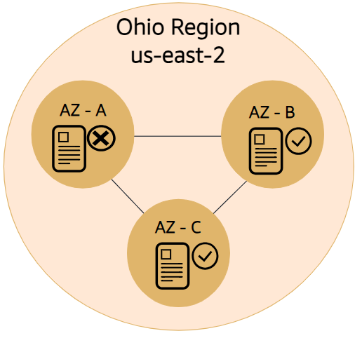
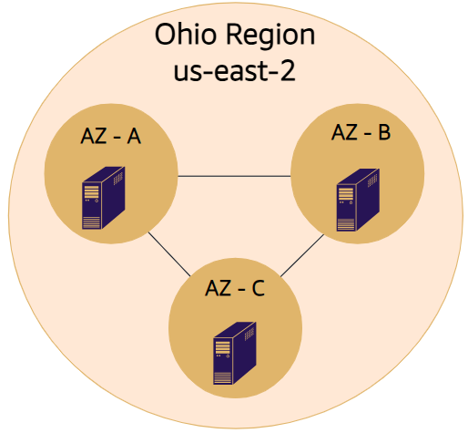
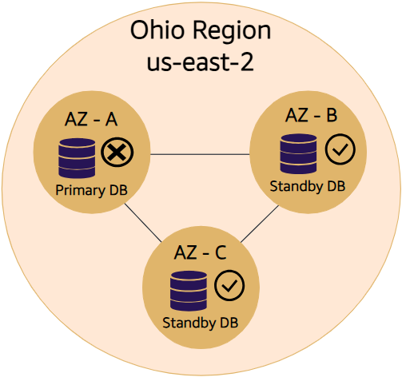

#  Day 1 – Cloud Basics & AWS Foundation

## What I Learned

### 1. Cloud Computing & Its Benefits
Cloud computing refers to the on-demand delivery of IT resources such as servers, databases, networking, and storage through the internet, with a pay-as-you-go pricing model. This eliminates the need for owning or maintaining physical data centers and allows quick access to scalable resources.
- On-demand delivery of computing resources over the internet.
- No upfront capital expense – only pay for what you use.
- Eliminates the need to manage/maintain physical data centers.
- Easily scalable (up or down) based on demand.
- Fast deployment and global availability.
---
### 2. Cloud Deployment Models
- **IaaS (Infrastructure as a Service)**: 
  - We manage OS, runtime, data in brief we manage the configuration of the infra we were provieded with
  - the services we are provide with are networking features, computers(this includes both virtual and dedicated hardware), storage spaces etc
  - Examples: EC2 (compute), S3 (storage), VPC (networking).
- **PaaS (Platform as a Service)**:
  - we focus on coding and deployment
  - we manage the infrastructure and mainly focus on deployment and managment 
  - Examples: AWS Elastic Beanstalk, AWS Fargate.
- **SaaS (Software as a Service)**:
  - Ready-to-use applications or products that are delivered over the internet.
  - Examples: Gmail, Zoom, Salesforce.
---
### 3. AWS Global Infrastructure

Amazon Web Services (AWS) has built a robust and scalable infrastructure across the globe to ensure high availability, performance, and fault tolerance. This infrastructure is organized into multiple components:

#### Region
- A **Region** is a geographical area that contains a group of Availability Zones.
- Each Region is **physically isolated and independent** from others, with its own power, networking, and connectivity.
- Regions are designed to provide **redundancy and fault isolation**.

#### Availability Zone (AZ)
- An Availability Zone is **one or more data centers** located within a Region.
- Each AZ has **independent power, cooling, and networking**, but they are connected with other AZs in the same Region using high-speed fiber-optic links.
- AZs are designed for **fault tolerance** and allow for **high availability architectures**.

#### Edge Location
- Edge Locations are **data centers located in major cities** around the world.
- These are used to deliver content with **low latency** through services like **Amazon CloudFront**.
- Edge Locations are part of the **Content Delivery Network (CDN)** which helps in caching data closer to users.
#### Detailed Explanation
Region is a place in the world where multiple availablity zones are there. Each Availability zone has multiple data centers and these availability zones in a region are connected with each other. Each AZ within a Region is linked to the others through high-bandwidth, low-latency, and redundant private fiber-optic networking. Edge locations are like small data centers in the world located accross cities which helps in caching and delevring static content fast.
> ###### Example:
> Let's say I'm in India, in a small city called Guntur, and I'm watching a video on a website. The nearest AWS Region to me is `ap-south-1`, located in Mumbai. The video might originally be stored in an S3 bucket or media server hosted in that region—or even in a different region entirely. However, instead of streaming the video directly from the Region (which could introduce latency or buffering), AWS uses a service like **CloudFront** to cache the video content at an **Edge Location** near me. When I request the video, CloudFront checks if a cached copy exists in the closest Edge Location (possibly in Hyderabad, Chennai, or another nearby city). If available, the video is delivered from there with minimal delay. If not, the Edge Location fetches it from the origin (e.g., Mumbai), caches it, and then serves it to me. This setup ensures high performance, low latency, and reliable delivery for the end user.
#### Planning for failure
| | |
|----------|---------|
||When a file is stored in Amazon S3, the file is redundantly copied into every Availability Zone in that Region. If one Availability Zone goes down, you still have two copies of that file available for you to use.|
||It is a best practice to spread out your computing resources across multiple Availability Zones to guarantee high availability. So, if one Availability Zone goes down, your architecture is still up and running.|
||You can configure your database for Multi-AZ deployment. If your Availability Zone with your primary database fails, one of the standby databases in a healthy Availability Zone automatically becomes your new primary database. Therefore, your architecture is still functioning.|

---

### 4. AWS Shared Responsibility Model
- **AWS is responsible for**:
  - Physical security of data centers.
  - Network infrastructure and foundational services.
- **Customer is responsible for**:
  - Data encryption.
  - Identity & Access Management (IAM).
  - Application-level security.
    
---
### 5. AWS Well-Architected Framework (6 Pillars)
1. **Operational Excellence** – Monitor and improve systems to deliver business value.
2. **Security** – Protect data and systems through risk assessment and mitigation.
3. **Reliability** – Quickly recover from failure and scale to meet demand.
4. **Performance Efficiency** – Use IT and computing resources effectively.
5. **Cost Optimization** – Avoid unnecessary costs; use right resources at right price.
6. **Sustainability** – Minimize environmental impact of running cloud workloads.

---

End of Day 1  
Date: 2025-07-23  

